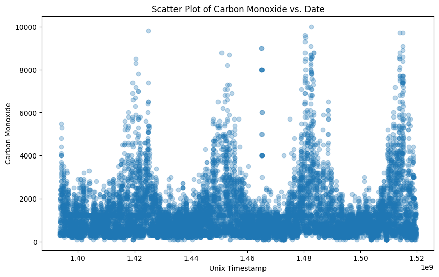
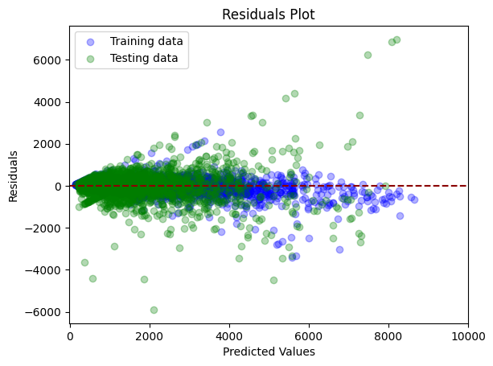

# Regression Analysis of Air Quality Data: Predicting Carbon Monoxide Levels

## Overview

The health department of Lechi has identified a troubling increase in pollution indicators, particularly in carbon monoxide (CO) levels. This rise poses significant threats to both public health and the environment. In response, our project aims to leverage data science to accurately predict CO concentrations, providing policymakers with actionable insights to address the issue effectively.

Our focus is on tackling the escalating CO pollution in Lechi through the development of a predictive model. By employing various data science techniques, we evaluated several regression models to determine the most effective approach. Notably, the selected model exhibits a strong R-squared value of 0.81, indicating its ability to discern the factors influencing CO levels.

Armed with this predictive capability, decision-makers in Lechi can craft targeted strategies to mitigate CO emissions. By identifying the primary contributors to pollution, our model facilitates the implementation of impactful measures, thereby improving air quality and public health, particularly among vulnerable populations.

Moreover, the adaptable nature of our model extends its utility beyond Lechi, offering broader opportunities for regional air quality management. Through collaboration and informed decision-making, we strive to create a healthier environment for all.

### Dataset description

This project utilizes a comprehensive dataset spanning 2014-2018, containing hourly records of weather, environmental, and air quality measurements relevant to CO concentrations. Data was generously provided by a kind academic professor.

The dataset contains 14,000 data points with 12 attributes, as shown in the following table:

## Data exploration and preprocessing

This section outlines the data exploration and preprocessing steps undertaken to prepare the dataset for model building. These steps ensure data quality and suitability for accurate analysis and robust models.

***Key Tasks:***
-	**Data Structure:** Verified data types, identified inconsistencies (e.g., date formatting), and addressed them.
-	**Missing Values:** Assessed missingness extent and distribution, employing appropriate imputation techniques.
-	**Data Visualization:** Explored data distributions and central tendencies with histograms, boxplots, etc.
-	**Categorical Encoding:** Transformed categorical variables (e.g., wind direction) into numerical representations.
-	**Feature Engineering:** Created informative features based on domain knowledge and data relationships.
-	**Feature Scaling:** Applied normalization or standardization techniques to ensure compatibility with modeling algorithms.
-	**Dimensionality Reduction:** Evaluated the need for dimensionality reduction using techniques like PCA.

These steps resulted in a clean, informative, and well-prepared dataset for subsequent analysis and model building.

### Addressing missing values

The initial exploration identified missing values in 10 columns, affecting a total of 1% of the data. Analysis suggests these values are likely Missing at Random (MAR).

***Strategies:***

-	**Numerical Variables:** Missing values in numerical columns like temperature and pressure were imputed using the mean due to its simplicity and efficiency given the low missingness rate (1%). However, it's important to acknowledge potential limitations with non-normally distributed data.
-	**Categorical Variables:** Missing values in categorical variables like "Wind" were addressed using "No" under the assumption of absent wind activity. However, replacing missing values with the most frequent category could be another strategy to test.

Following imputation, all missing values were successfully addressed, resulting in a complete dataset for further analysis. While these approaches were deemed appropriate considering the data and context, alternative strategies might be suitable depending on future data quality issues and analysis goals.

### Data exploration and visualization

Data exploration delved into visualizing the relationships between environmental variables and CO concentrations, aiming to inform feature selection and model development. Various visualization techniques provided key insights:

-	**Scatter plot analysis:** Revealed a positive trend between nitrogen dioxide (nitr_diox) and CO, suggesting its potential as a predictor variable, as shown below:

-	**Bar plot:** Highlighted variations in mean CO concentration across different wind directions, indicating its possible influence on CO levels, as shown in the following plot:

-	**Heatmap visualization:** Identified strong positive correlations between CO and variables like small_part, med_part, sulf_diox, and nitr_diox, while trioxygen and temperature exhibited moderate negative correlations:

The correlation matrix revealed high correlations among some predictor variables, potentially leading to multicollinearity, redundancy, and model complexity issues. To address this, the following strategies were implemented:

-	**Feature selection:** Employed techniques to identify and select the most relevant and informative variables for CO prediction.
-	**Dimensionality reduction:** Explored techniques like PCA to reduce feature space dimensionality while preserving key information.
-	**Regularization:** Utilized methods like ridge and lasso regression to automatically handle multicollinearity by penalizing large coefficients.

By proactively addressing these challenges, we aim to build a robust and interpretable predictive model for CO concentration forecasting.

### Encoding categorical variables

This section describes the encoding of categorical variables for inclusion in our predictive model.

-	**Date:** The "date" variable was converted to DateTime format to address inconsistencies and missing entries. This ensures an accurate representation of temporal features.
-	**Wind:** One-hot encoding was performed. This approach creates dummy variables for each category, transforming them into numerical features suitable for model training.

### Feature engineering

Feature engineering played a crucial role in boosting the predictive power of our regression models. We focused on extracting meaningful insights from the "date" variable using various approaches:

-	**Temporal Decomposition:** Created features like year, month, day of week, and day of year to capture potential time-based patterns and seasonality.
-	**Timestamp Conversion:** Transformed the "date" variable into Unix timestamps, providing a numerical representation for smoother integration with regression models. This facilitated capturing temporal dependencies and seasonality, potentially improving model accuracy.

Redundancy and dimensionality were key considerations during feature engineering. We carefully crafted features that avoided replicating existing information to avoid overfitting and multicollinearity. Additionally, we evaluated the number of features to ensure efficient model training. This approach involved experimenting with various feature sets and meticulously assessing their impact on model performance using appropriate metrics. This ensured the chosen features provided the most relevant information without unnecessary bloat, ultimately contributing to a robust and efficient model.

As an example, we assessed the relationship between the newly created timestamp feature and the target variable by visualizing their relationship using a scatter plot:

While no direct correlation is evident, the scatter plot reveals a distinct seasonal pattern for carbon monoxide concentration, resembling cyclical waves. This suggests potential seasonality factors influencing carbon monoxide levels that warrant further investigation and may prove valuable for model improvement.

### Data selection

While this model iteration did not directly employ feature selection techniques, there may be potential benefits in implementing it.

Feature selection can often enhance model performance and interpretability by eliminating redundant or irrelevant information. In some cases, using a reduced feature subset can significantly improve accuracy and generalization.

However, in the current context, including all available features yielded the best performance based on metrics like R-squared and MAE. This could be due to several factors, such as:
-	**Complementary relationships:** The full feature set likely contains crucial interactions or relationships that wouldn't be captured with a reduced subset.
-	**Limited data:** With a smaller dataset, eliminating features could potentially lead to information loss and hinder the model's learning ability.
-	**Model suitability:** The chosen model types might be less sensitive to redundancy and benefit from the additional information provided by all features.

Exploring various approaches is crucial during model development. While feature selection wasn't ultimately employed in this specific case, the provided code can be used to utilize it when appropriate.

### Scaling

Feature scaling, a preprocessing technique used to standardize the range of features in a dataset, plays a crucial role in ensuring equitable treatment of features during model training. By transforming data to a specific range, scaling addresses differences in feature scales and units, ultimately improving the performance and convergence of many machine learning algorithms.

In our analysis, we employed ‘StandardScaler’ to address the potential dominance of features with larger magnitudes over those with smaller values. This technique effectively transformed each feature to have a mean of 0 and a standard deviation of 1, neutralizing potential biases. Notably, ‘StandardScaler’ is particularly beneficial for distance-based algorithms like KNN and SVM, where feature scale directly impacts distance calculations between data points.

To prevent information leakage from the testing set influencing the scaling process and leading to inflated performance estimates, we adhered to the best practice of performing scaling after splitting the data into training and testing sets. This ensures the scaling parameters are derived solely from the training data and then applied consistently to the testing data, preserving the integrity of the evaluation process and providing more reliable performance metrics.

### Principal component analysis

Principal Component Analysis (PCA) played a role in exploring the inherent structure and potentially reducing the dimensionality of our data. This technique aimed to identify the key directions of variance, known as principal components, while preserving the most significant information.

While PCA identified 28 components in total, our analysis revealed that the initial components did not capture a substantial portion of the overall variance individually. The provided plot of explained variance per component suggests a relatively even distribution of variance across most components, indicating no single component holds overwhelming explanatory power. This observation aligns with scenarios where the information is spread more uniformly across many dimensions.

Furthermore, both the plot of explained variance per component and the cumulative explained variance ratio plot (presented below) lacked a clear "elbow." This absence of an elbow suggests that the data may not have a strong underlying structure that can be effectively captured by a small number of principal components.

It's important to note that although we analyzed the data using PCA, we did not utilize it for dimensionality reduction in the final model. This is because, as mentioned above, the data lacked a clear structure suitable for significant variance capture with a small number of components. 

Additionally, we always adhere to the best practice of fitting PCA on the training data only and then applying the same transformation to both the training and testing sets. This ensures that information from the testing set does not influence the PCA transformation, preventing data leakage and leading to more reliable performance evaluation.

Despite the limited usefulness of PCA in this specific case, the insights gained through its exploration remain valuable. The observed variance distribution, the absence of clear elbows, and the lack of strong underlying structure point towards alternative dimensionality reduction strategies being more suitable for our specific analysis goals. Exploring techniques like feature selection or incorporating domain-specific knowledge could be valuable in determining the most appropriate approach.

## Model training and evaluation

This section delves into the comprehensive process of training and evaluating multiple regression models to identify the best performer for predicting carbon monoxide concentration. Our analysis involved:

**Exploring Diverse Algorithms:** We investigated the predictive capabilities of various models, including k-nearest neighbors (KNN), support vector regression (SVR), decision tree, random forest, linear regression, ridge regression, and lasso regression. This exploration aimed to discover which algorithm could best capture the underlying patterns within our data.

**Hyperparameter Tuning for Optimization:** To optimize the performance of each algorithm, we employed grid search, a popular hyperparameter tuning technique. Grid search systematically evaluates a predefined set of hyperparameter values and selects the combination that yields the best performance based on cross-validation. Through this process, we identified the optimal hyperparameters that maximized the performance of each model.

**Cross-Validation for Robust Assessment:** Cross-validation played a crucial role in ensuring the generalizability of our models. This technique involves splitting the data into multiple folds and iteratively training and evaluating models on different combinations of training and testing sets. Cross-validation provides more reliable performance estimates by mitigating the impact of data variability and ensuring the models' performance is evaluated across diverse data partitions.

**Evaluation Metrics for Informed Decisions:** We utilized various evaluation metrics to quantify the performance of each regression model, including mean absolute error (MAE), mean squared error (MSE), root mean squared error (RMSE), and coefficient of determination (R²). These metrics offer insights into how well the model's predictions align with the actual target values, guiding our decisions regarding model selection and potential areas for improvement.

**Visualizing Performance with Residual Plots:** Visualizing the distribution of residuals, the difference between predicted and actual target values, is crucial for interpreting regression model performance. In the provided example of a residual plot for the Random Forest Regressor, we observe distinct patterns in the training and testing data:

-	**Training residuals:** Evenly distributed around zero across the range of predicted values, indicating the model effectively learned the patterns within the training data.
-	**Testing residuals:** Gradually increase as predicted values get larger, suggesting the model encounters challenges in accurately predicting higher concentrations of carbon monoxide.

The accompanying histogram plot of carbon monoxide concentration reveals a left-skewed distribution, implying a majority of data points concentrate toward lower values. 

This distribution imbalance might contribute to the observed pattern in the residual plot.

-	**Advantages at lower ranges:* With more training examples and potentially less variability in lower concentration ranges, the model achieves better performance, reflected by smaller residuals.
-	**Challenges at higher ranges:** As the number of observations with higher concentrations decreases, the model's performance deteriorates, indicated by larger residuals. This suggests the model might struggle to learn from fewer training examples and increased variability in this range.

The observed patterns highlight the importance of considering the target variable's distribution and its potential impact on model performance. Further exploration and potentially tailored techniques to address the data imbalance, particularly for higher concentration ranges, could be valuable in enhancing the model's overall predictive accuracy.

## Conclusion

Drawing to a close, our data science project culminated in an in-depth exploration of regression modeling to address the pressing challenge of rising carbon monoxide (CO) levels in Lechi. This issue directly threatens the health and environment of the city, demanding immediate action. Recognizing this urgency, we leveraged data science tools and techniques to develop a robust prediction model capable of providing actionable insights for policymakers.

### Model comparison and performance

Delving into the heart of our analyses, we compared the performance of various regression models through rigorous cross-validation and evaluation metrics. As visualized in the provided bar graphs, we observed nuanced variations in their predictive capabilities.

Among the contenders, Random Forest emerged as the champion, boasting the highest R-squared value of 0.81 and the lowest Mean Absolute Error (MAE) compared to its peers. This translates to its ability to capture a significant portion of the underlying patterns in the data and deliver relatively accurate predictions for CO concentrations.

However, a healthy dose of skepticism is essential. While achieving a laudable R-squared value, our models also reveal limitations, particularly in their ability to predict higher CO values. The observed divergence of residuals for these observations hints at a potential bias towards underestimating or overestimating the target variable, suggesting avenues for further model refinement.

### Addressing model limitations

Here are some key opportunities for future exploration:

-	**Regularization Techniques:** While exploring techniques like Ridge or Lasso regression to mitigate overfitting and enhance generalization performance didn't yield significant improvements in our case, further investigation into different hyperparameter settings or alternative regularization methods might prove fruitful.
-	**Feature Selection and Multicollinearity:** Our exploratory data analysis revealed the presence of multicollinearity within the dataset, indicating potential redundancy among predictor variables. Addressing this through feature selection techniques like forward selection or backward elimination could contribute to reducing model complexity and potentially improving generalizability.

By diligently addressing these areas, we can strive to enhance the model's predictive capabilities and provide even more valuable insights for policymakers.

### Recommendations for future work

While our explorations have yielded valuable insights, further avenues beckon for researchers seeking to refine and enhance the model's predictive capabilities. Here are some potential considerations for future endeavors:

-	**Expanding the Feature Landscape:** Incorporating additional features or engineering new ones, particularly those related to weather patterns or atmospheric influences, could capture more nuanced relationships within the data, potentially leading to improved model performance.
-	**Exploring Algorithmic Frontiers:** Experimenting with different algorithms and model architectures, such as ensemble methods like XGBoost, might unlock further accuracy gains by handling complex interactions within the data more effectively.
-	**Embracing Continuous Validation:** As with any model development process, ongoing validation and iterative refinement are paramount. Implementing robust strategies like hold-out testing and actively seeking feedback from stakeholders during real-world deployments can ensure the model remains accurate, interpretable, and actionable in practice.

By diligently pursuing these potential avenues, future researchers can contribute to the development of increasingly accurate and reliable predictive models for environmental monitoring and public health initiatives, ultimately empowering policymakers with invaluable insights to combat rising CO levels and safeguard Lechi's air quality.

## Tools and technologies

- **Python Programming Language:** Python served as the primary programming language for this project, offering a rich ecosystem of libraries and tools for data analysis, machine learning, and visualization.
- **Pandas:** Pandas, a powerful data manipulation library in Python, facilitated data loading, manipulation, and analysis. It provided functionalities for handling structured data, including reading and writing data from various file formats, data cleaning, and aggregation.
- **NumPy:** NumPy, a fundamental package for scientific computing in Python, enabled efficient handling of arrays and matrices, essential for numerical operations and mathematical computations.
- **Matplotlib and Seaborn:** Matplotlib and Seaborn were employed for data visualization, offering a wide range of plotting functionalities to create informative and visually appealing visualizations, such as scatter plots, bar plots, and heatmaps.
- **Scikit-learn (sklearn):** Scikit-learn, a comprehensive machine learning library in Python, provided tools for data preprocessing, model selection, hyperparameter tuning, and evaluation. We utilized various modules from scikit-learn, including preprocessing, model_selection, ensemble, linear_model, and tree, to implement regression models and evaluate their performance.
- **StandardScaler:** StandardScaler from scikit-learn's preprocessing module was used to standardize the features by removing the mean and scaling to unit variance, ensuring that all features contribute equally to the model fitting process.
- **Principal Component Analysis (PCA):** PCA, available in scikit-learn's decomposition module, was employed for dimensionality reduction and feature extraction. It enabled us to capture the most significant sources of variation in the data by projecting it onto a lower-dimensional space.
- **GridSearchCV:** GridSearchCV from scikit-learn's model_selection module facilitated hyperparameter tuning through an exhaustive search over a predefined grid of hyperparameter values. It helped identify the optimal hyperparameters for the regression models, maximizing their performance.
- **RandomForestRegressor, LinearRegression, Ridge, Lasso, DecisionTreeRegressor, KNeighborsRegressor, SVR:** These regression algorithms, available in scikit-learn's ensemble, linear_model, tree, and SVM modules, were employed to build predictive models for estimating carbon monoxide concentrations based on environmental and climatic variables.

## Remarks and instructions for usage

**1. Data Origin:**
- The dataset used in this project was generously provided by a respected academic source, ensuring its reliability and relevance to the research domain.

**2. Setup:**
- Ensure that your Python environment is equipped with the necessary packages listed in the "Tools and Technologies" section. These libraries are essential for conducting data analysis, modeling, and evaluation.

**3. Data Usage:**
- Throughout model training, we utilized scaled data for improved model convergence and performance. However, you have the flexibility to explore alternative approaches, such as using unscaled data or Principal Component Analysis (PCA) components that are provided in the notebook, to assess their impact on model outcomes.
- All explanatory variables were incorporated during model training. You're encouraged to experiment with different subsets of variables to evaluate their influence on model performance, considering factors like generalizability, model simplicity, and computational efficiency.

**4. Additional Remarks:**
- Continuous exploration of diverse preprocessing techniques and feature engineering methods may reveal further insights and optimizations in model performance. Feel free to explore alternative strategies and iterate on the provided notebook to enhance project outcomes and insights.
- Consider conducting sensitivity analyses to assess the robustness of the models to variations in hyperparameters, input data, or modeling assumptions. This can provide valuable insights into the models' stability and reliability in different scenarios.

**5. Contact:**
- For any inquiries, collaboration opportunities, or feedback, please don't hesitate to connect with me on [LinkedIn](https://www.linkedin.com/in/hamidrezarahimi/). Your insights are highly valued and appreciated.
